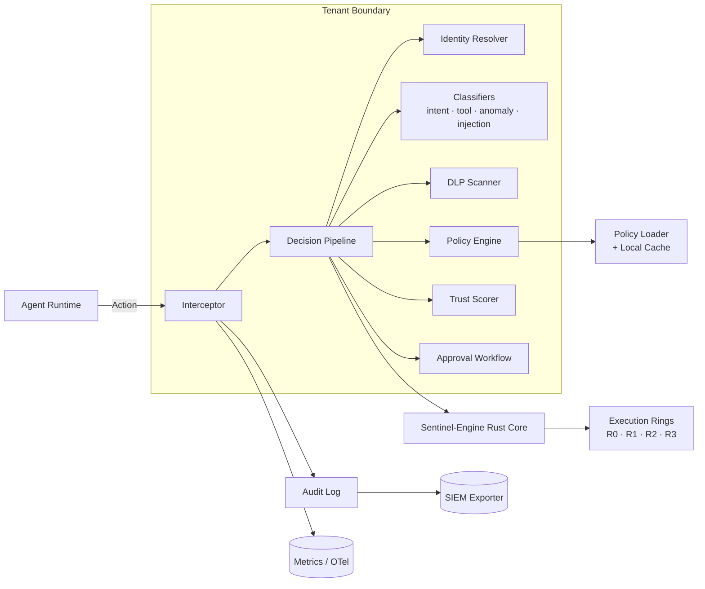

# Architecture

`osl-agent-sentinel` is built as a **two-tier system**:

1. A **Python control plane** that owns the decision pipeline, identity registry, policy bundles, audit log, approval workflow, observability, multi-tenant scoping, and HTTP API.
2. A **Rust execution-ring engine** (`sentinel-engine`) that owns the isolation tiers, signing primitives, and the per-action hot-path checks.

The control plane orchestrates; the engine enforces.

## High-level diagram

## Decision pipeline (ordered)

1. **Interceptor** normalizes the action and verifies the agent signature.
2. **Identity Resolver** loads the agent's `Identity` (circuit-breaker protected; fail-closed to last-known-good).
3. **Classifiers** run in parallel:
   - `IntentClassifier` — declared-intent vs. action-shape divergence (goal hijacking).
   - `ToolValidator` — capability + JSON-Schema validation (tool misuse).
   - `AnomalyDetector` — rolling-window baseline vs. current behavior (rogue agent, cascading failure).
   - `PromptInjectionDetector` — prompt-injection / instruction-override patterns.
4. **DLP Scanner** inspects arguments for sensitive data shapes.
5. **Policy Engine** evaluates the active signed `PolicyBundle`. The most restrictive matching rule wins.
6. **Trust Scorer** gates the verdict by the identity's current tier.
7. **Approval Workflow** parks `ESCALATE` decisions for human review.
8. **Audit + SIEM** — every decision is appended to a hash-chained, signed audit log and exported.

## Fail-closed degradation

When a dependency (policy source, identity store, DLP backend) is unavailable, the pipeline:

- Trips the per-dependency circuit breaker.
- Falls back to the **local signed bundle cache** for policies and the **last-known-good identity snapshot**.
- Flags every decision made during degradation with `degraded=True` so SIEM and operators can distinguish authoritative from cached verdicts.

## Multi-tenancy

Every `Action`, `Identity`, `PolicyBundle`, and `AuditRecord` is scoped by `tenant_id`. Tenants are isolated at:

- **Policy load** — each tenant has its own signed bundle.
- **Identity registry** — DID lookups are tenant-scoped.
- **Audit stream** — separate hash chains per tenant; SIEM export honors tenant routing.
- **Rate limiting** — per-tenant token buckets at the HTTP layer.

## Explainable denials

Every `DENY` and `ESCALATE` decision returns an `explanation` field containing:

- The matched rule ID(s).
- The contributing `RiskFactor`s and their scores.
- The identity's current trust tier.
- A human-readable rationale suitable for SIEM and analyst review.

## OWASP Agentic AI Top 10 mapping

| Code | Threat | Controls in this project |
| --- | --- | --- |
| AGENT-01 | Goal hijacking / prompt injection | `IntentClassifier`, `PromptInjectionDetector`, policy intent constraints |
| AGENT-02 | Memory poisoning | `MEMORY_WRITE` policy rules, `CMVK` receipts |
| AGENT-03 | Tool misuse | `ToolValidator`, capability checks |
| AGENT-04 | Identity abuse | `IdentityResolver`, signed actions, capability scoping |
| AGENT-05 | Rogue agents | `AnomalyDetector`, trust scoring, throttle verdicts |
| AGENT-06 | Supply chain | Tool quarantine list, signed policy bundles |
| AGENT-07 | Code execution abuse | Execution rings, sandbox shim, shell-command policy |
| AGENT-08 | Insecure inter-agent comms | `IATP` envelopes, signed messages |
| AGENT-09 | Cascading failures | Circuit breakers, rate limits, anomaly detection |
| AGENT-10 | Trust exploitation | Approval workflow, ESCALATE verdicts on persuasion patterns |

## Why Python + Rust

- **Python** is the right host for the policy DSL, integrations, FastAPI, and the wider AI tooling ecosystem. Most of sentinel's value is orchestration.
- **Rust** is the right host for the hot path. Signature verification, ring policy enforcement, and deterministic matching must be panic-free, bounded, and side-channel-aware. `sentinel-engine` is `#![forbid(unsafe_code)]` and ships as a PyO3 extension.

## Threat model summary

See `SECURITY.md` for the full threat model. Key assumptions:

- Sentinel is in the trust boundary; if its host is compromised, all bets are off.
- Policy bundles are signed by a key sentinel does not hold.
- Agent runtimes are *not* trusted; every action is treated as untrusted input.
